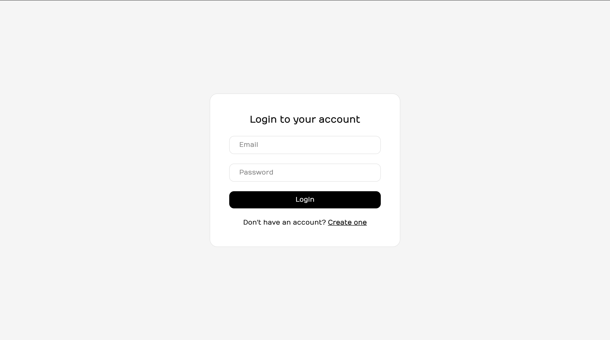
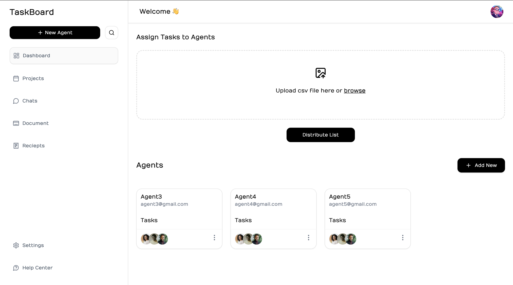
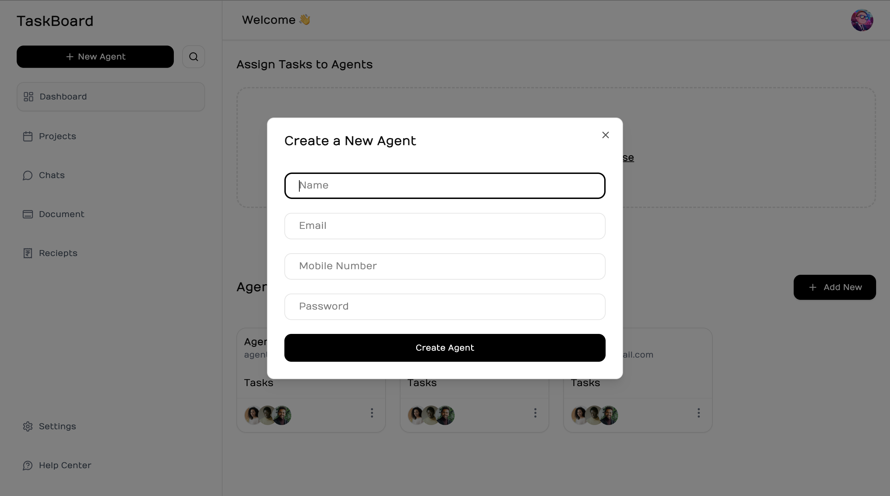
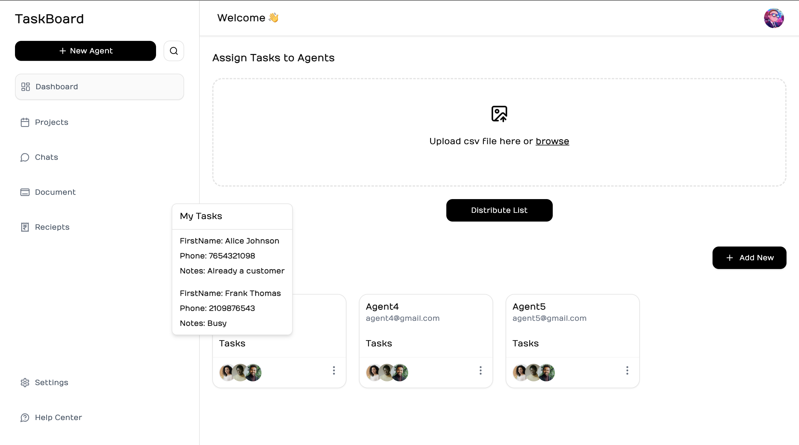

# Welcome to TaskBoard 👋
TaskBoard is a Task Distribution Application that parses csv data & distributes tasks to all agents.

<div style="display: flex; flex-wrap: wrap; gap: 30px;">
  
  
  
  
</div>

## Get Started
1. Clone the repository
```bash
git clone https://github.com/LEELAMANOHARGUDIVADA/cstechinfosolutions-assignment.git
```

2. Navigate to client directory and install dependencies
```bash
cd client
npm install
```

3. Add a .env file in the root directory of client folder and add the below environment variables
```bash
VITE_API_URL='your-server-url'
```

4. Navigate to server directory and install dependencies
```bash
cd server
npm install
```

5. Add a .env file in the root directory of server folder and add the below environment variables
```bash
PORT=8000
MONGODB_URI="your-mongodb-uri"
CLIENT_URL="your-client-url"
JWT_SECRET="your-jwt-secret"
```

6. Now, you can start your client and server in their respective directories by running the command.
```bash
npm run dev
```